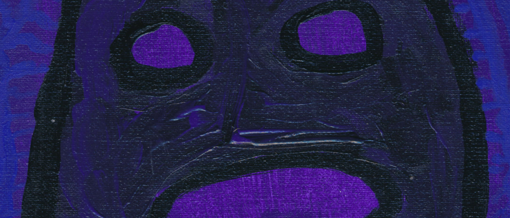

<h1 align=center>

</h1>

#### От ZQWY, Идём На Восток!

#### ZQWY — творческий гибрид: слепленный разными цветами, залит палитрой и стихами, музыкальный визионерский колорит. По пути к пустоте, а во тьме — сложность мыслей. А суть к полноте, в свете — легкость идей. Формирование методов, симметрии: Еврейская естественность и Греческая мыслительность. Различия отличительные, зеркальные, но разительные.

#### [Мультижанр](войдсторм.md), мультикультура, мультиязык
#### Слияние в безобразный вид. Жанры, культуры и язык - сковывают! Использую все инструменты что попадаются в руки и изобретать стремлюсь 😀 

#### Меня [штормит](войдсторм.md) от множества жанров: [фонк](phonk), [фолк](folk), [эмбиент](ambient), [дроун](drone), [нойз](noise), [метал](metal), [хаус](house), [техно](techno)

#### В лесу фантазий, [на гране](na_hrane) — [белая](biela) лань, а иная — тёмная лань

#### Музыка, эпос, стихи, искусство, синтез, композиторство, сочинить: креатив, снимая его! Короче — пустая трата ресурсов, кто бы мог подумать?

<h1 align=center>

</h1>
